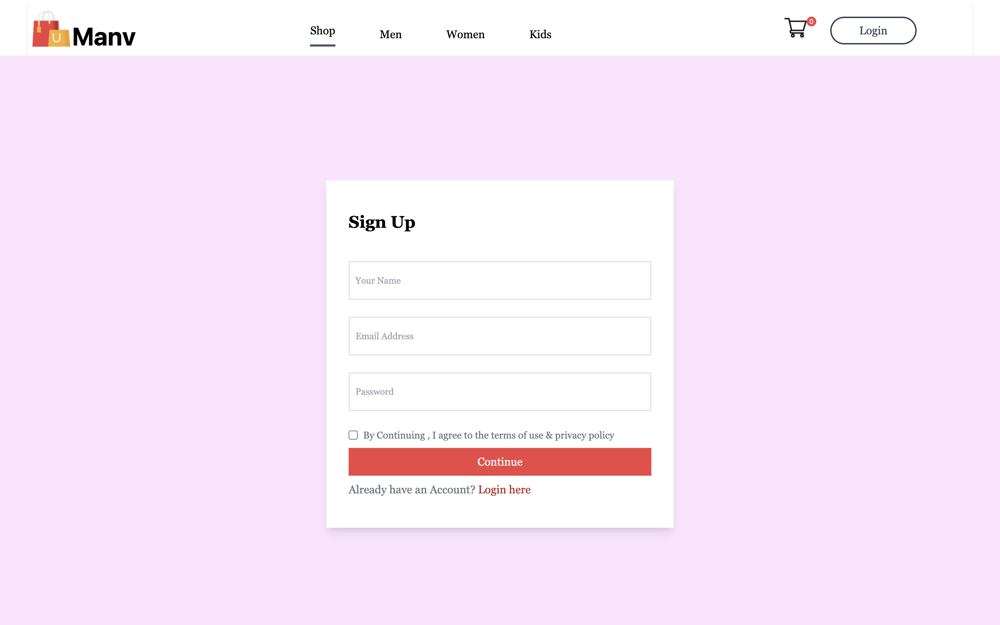
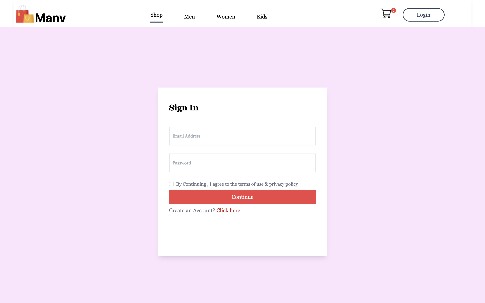
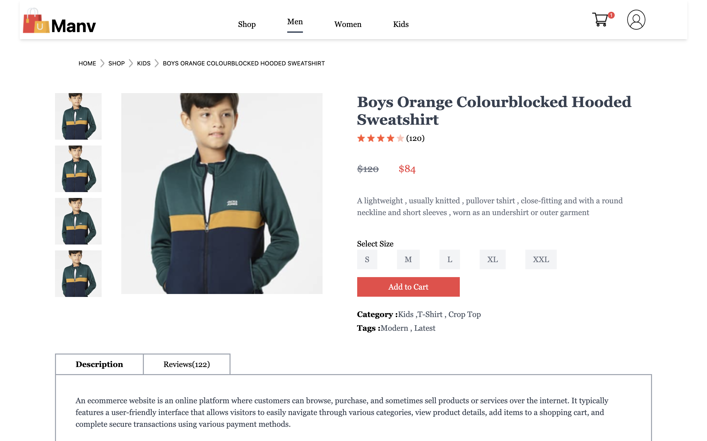
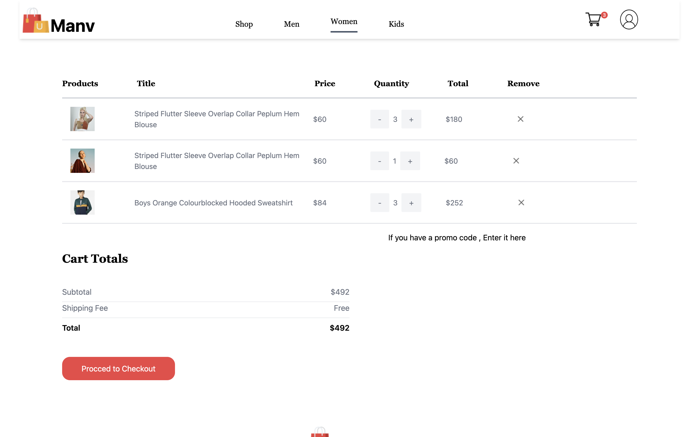
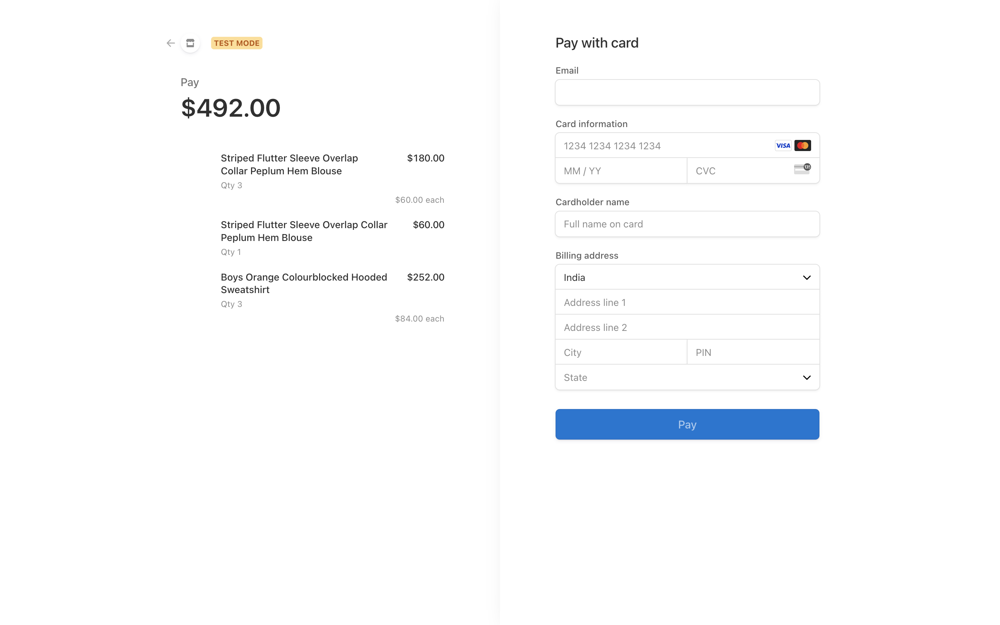
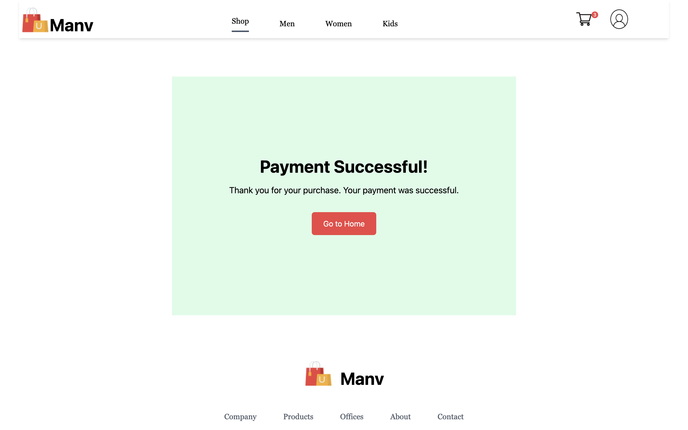
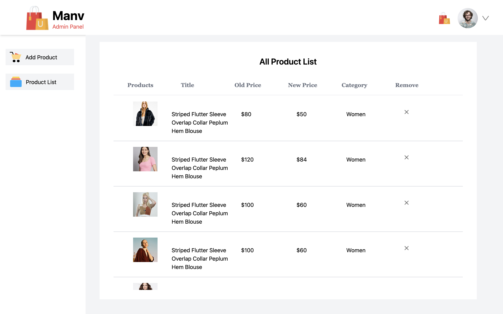
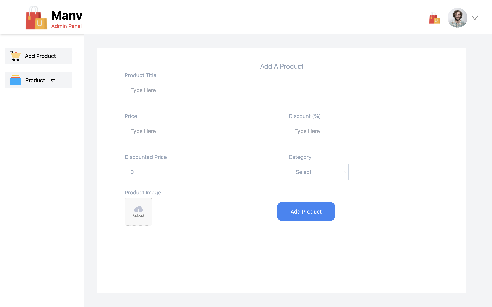

# MERN Ecommerce Project














## Table of Contents
- [Introduction](#introduction)
- [Features](#features)
- [Technologies](#technologies)
- [Installation](#installation)
- [Usage](#usage)
- [API Endpoints](#api-endpoints)
- [Stripe Integration](#stripe-integration)


## Introduction
This is a full-stack ecommerce application built using the MERN stack (MongoDB, Express.js, React, and Node.js). The application allows users to browse products, add items to their cart, and complete purchases using Stripe for payment processing.

## Features
- User Authentication (Register/Login)
- Product Listing
- Shopping Cart
- Order Management
- Payment Integration with Stripe
- User Profile Management

## Technologies
- **Frontend:** React, Context API
- **Backend:** Node.js, Express.js
- **Database:** MongoDB, Mongoose
- **Authentication:** JSON Web Token (JWT)
- **Payment Gateway:** Stripe

## Installation

1. **Clone the repository**
   ```sh
   git clone https://github.com/yourusername/mern-ecommerce.git
   cd mern-ecommerce

2. **Install dependencies for the server**
    ```sh
    cd backend
    npm install
    ```

3. **Install dependencies for the client**
    ```sh
    cd ../frontend
    npm install
    ```

4. **Set up environment variables**
    - Create a `.env` file in the `server` directory and add the following:
        ```env
        PORT=4000
        MONGO_URI=your_mongo_uri
        JWT_SECRET=your_jwt_secret
        STRIPE_SECRET_KEY=your_stripe_secret_key
        STRIPE_WEBHOOK_SECRET=your_stripe_webhook_secret
        ```

5. **Start the server**
    ```sh
    cd backend
    node index.js
    ```

6. **Start the client**
    ```sh
    cd ../frontend
    npm run dev
    ```

## Usage

- Visit `http://localhost:3000` to view the client application.
- The server runs on `http://localhost:4000`.

## API Endpoints

### User Authentication

- **Register**
    ```
    POST /api/auth/register
    ```

- **Login**
    ```
    POST /api/auth/login
    ```

### Product Management

- **Get all products**
    ```
    GET /api/products
    ```

- **Add a new product**
    ```
    POST /api/products
    ```

### Cart Management

- **Get cart details**
    ```
    POST /api/cart/getCartDetails
    ```

- **Add to cart**
    ```
    POST /api/cart/addToCart
    ```

- **Remove from cart**
    ```
    POST /api/cart/removeFromCart
    ```

### Order Management

- **Create checkout session**
    ```
    POST /api/orders/create-checkout-session
    ```

- **Webhook for payment success**
    ```
    POST /api/orders/webhook
    ```

## Stripe Integration

1. **Set up Stripe account**
    - Sign up for a Stripe account and get your API keys.

2. **Update Environment Variables**
    - Add your Stripe keys to the `.env` file in the `server` directory.

3. **Test Webhooks**
    - Use the Stripe CLI to test webhooks locally:
    ```sh
    stripe listen --forward-to localhost:4000/api/orders/webhook
    ```


